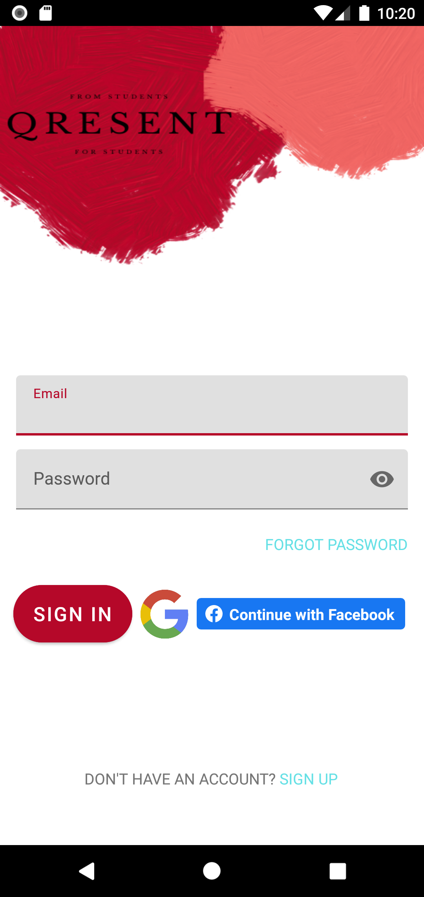
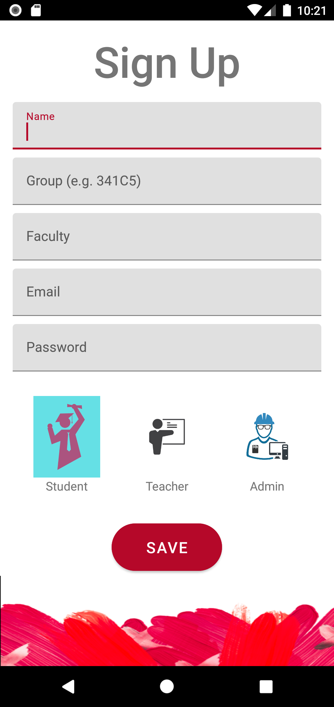
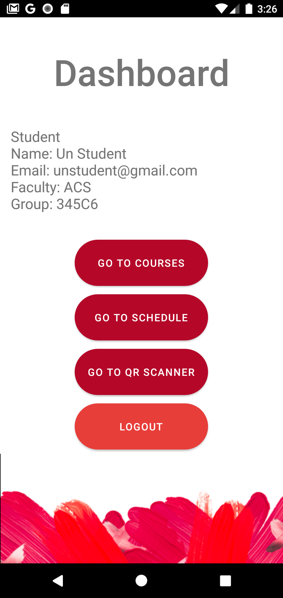
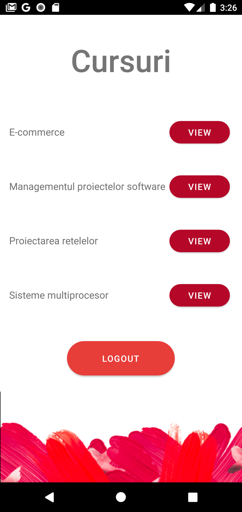
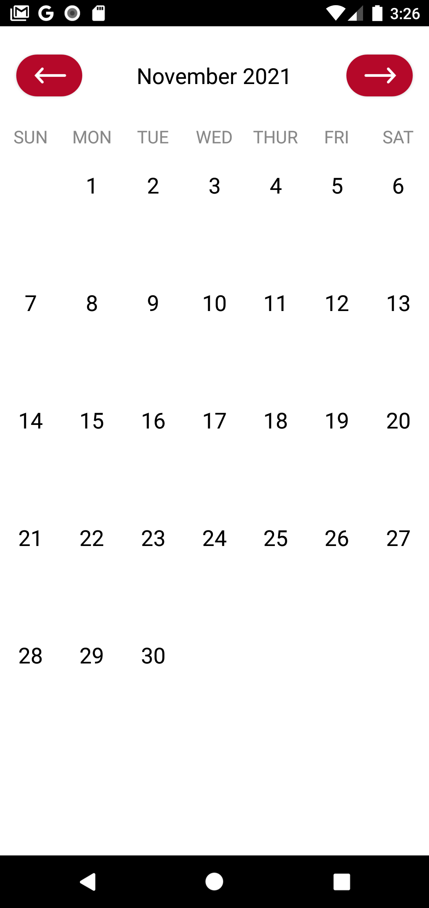
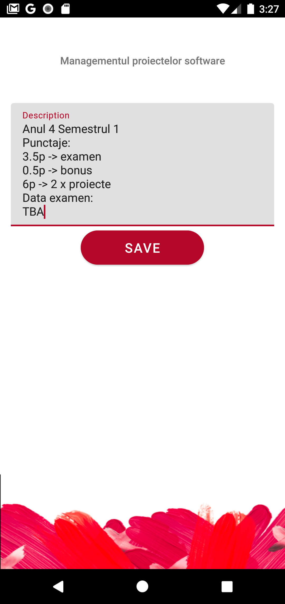
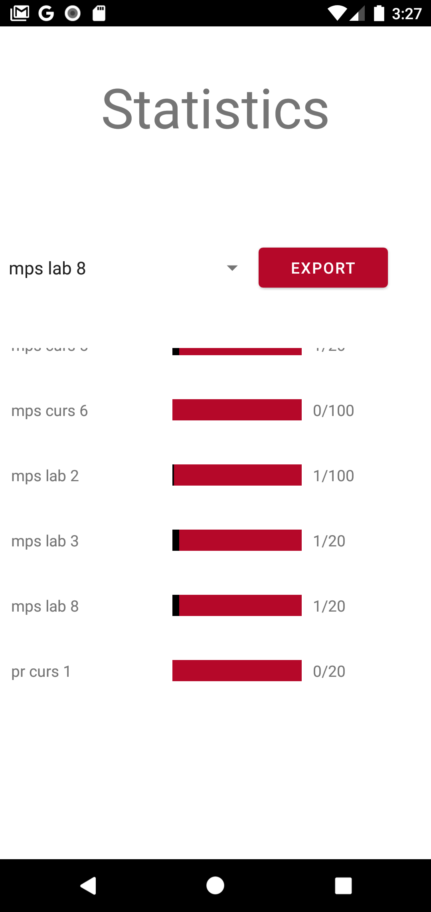

# mps-project-1

README PROIECT 1 MPS 
QResent 
 
&nbsp&nbsp&nbsp&nbsp- aplicație Android pentru digitalizarea sistemului de prezență, atât pentru formatul fizic, cât și pentru formatul online, pe baza generării de QR code-uri 
 
Aplicatia a fost creata cu ajutorul: 
&nbsp&nbsp&nbsp&nbsp- Java 
&nbsp&nbsp&nbsp&nbsp- Android Studio 
 
Tehnologii folosite: 
&nbsp&nbsp&nbsp&nbsp- Firebase Realtime Database 
&nbsp&nbsp&nbsp&nbsp- Firebase Authentication: Email and Password Sign-Up/Sign-In, Google Sign-In, Facebook Sign-In, Password Recovery, Logout 

          

 
Specificații Student: 
&nbsp&nbsp&nbsp&nbsp- vizualizarea datelor personale (nume, email, facultate, grupa) 
&nbsp&nbsp&nbsp&nbsp- vizualizarea cursurilor la care este înrolat și a descrierilor acestora (punctaj, praguri, data examenelor, bonusuri) 
&nbsp&nbsp&nbsp&nbsp- vizualizarea orarului 
&nbsp&nbsp&nbsp&nbsp- posibilitatea scanării QR code-ului generat de profesor pentru prezență 

          

 
Specificații Profesor: 
&nbsp&nbsp&nbsp&nbsp- vizualizarea datelor personale (nume, email, facultate) 
&nbsp&nbsp&nbsp&nbsp- vizualizarea cursurilor la care preda/tine laborator și a descrierilor acestora (punctaj, praguri, data examenelor, bonusuri). Posibilitatea editării descrierii cursurilor 
&nbsp&nbsp&nbsp&nbsp- vizualizarea orarului 
&nbsp&nbsp&nbsp&nbsp- generarea de cod QR pe baza unui sir de caractere introdus 
&nbsp&nbsp&nbsp&nbsp- vizualizarea statisticilor cu numărul de prezențe și exportarea listei de prezență 

     

 
Specificații Admin: 
&nbsp&nbsp&nbsp&nbsp- vizualizarea datelor personale (nume, email, facultate) 
&nbsp&nbsp&nbsp&nbsp- vizualizarea tuturor cursurilor și a descrierilor acestora (punctaj, praguri, data examenelor, bonusuri). Posibilitatea editării descrierii cursurilor 
&nbsp&nbsp&nbsp&nbsp- exportarea listei de prezență 
&nbsp&nbsp&nbsp&nbsp- înrolarea unui student la un anumit curs 
&nbsp&nbsp&nbsp&nbsp- adăugarea unui profesor la un curs/laborator 

 
Contributori: 
&nbsp&nbsp&nbsp&nbsp- Andrei Mocanu 
&nbsp&nbsp&nbsp&nbsp- Mara Georgescu 
&nbsp&nbsp&nbsp&nbsp- Nicolae Nițu 
&nbsp&nbsp&nbsp&nbsp- Olivia Oprea 
&nbsp&nbsp&nbsp&nbsp- Victor Barbu 
&nbsp&nbsp&nbsp&nbsp- Cosmin Cojocaru 

